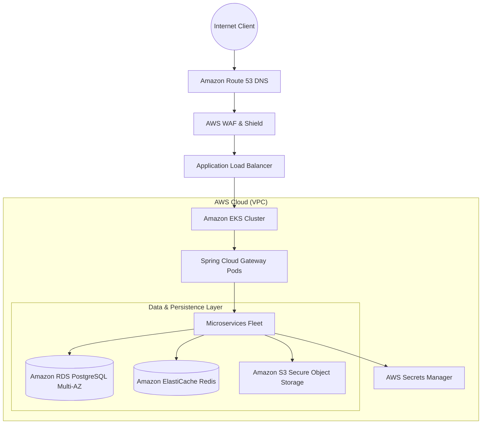

# AWS Architecture Diagram

The AWS infrastructure follows highly-available multi-AZ deployment strategies for Government workloads.

```mermaid
graph TD
    Internet((Internet Client)) --> Route53[Amazon Route 53 DNS]
    Route53 --> WAF[AWS WAF & Shield]
    WAF --> ALB[Application Load Balancer]
    ALB --> EKS[Amazon EKS Cluster]

    subgraph "AWS Cloud (VPC)"
        EKS --> APIGW[Spring Cloud Gateway Pods]
        APIGW --> Services[Microservices Fleet]

        Services --> Secrets[AWS Secrets Manager]

        subgraph "Data & Persistence Layer"
            Services --> RDS[(Amazon RDS PostgreSQL Multi-AZ)]
            Services --> Redis[(Amazon ElastiCache Redis)]
            Services --> S3[Amazon S3 Secure Object Storage]
        end
    end
```
