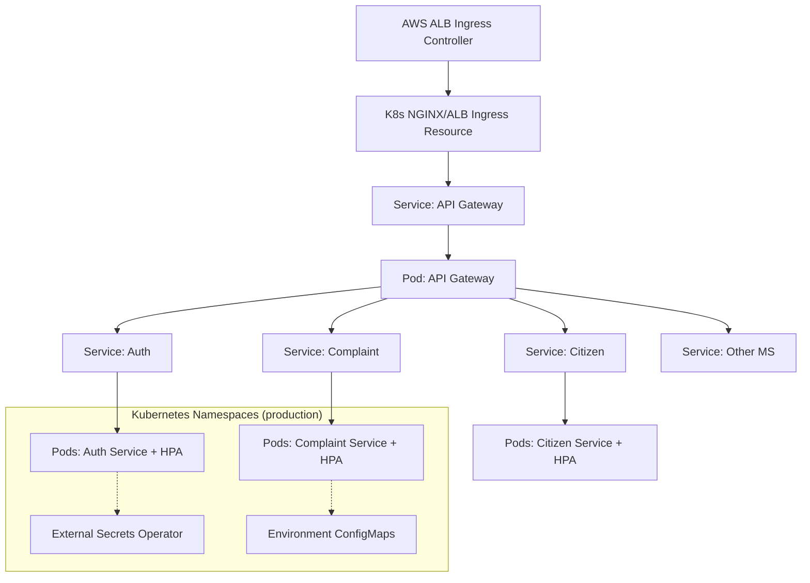

# Kubernetes Architecture (EKS)

The Kubernetes layer demonstrates traffic ingress, service meshes, zero-trust configuration, and horizontal scaling metrics inside the cluster.

```mermaid
graph TD
    ALB[AWS ALB Ingress Controller] --> Ingress[K8s NGINX/ALB Ingress Resource]
    Ingress --> GW_SVC[Service: API Gateway]

    GW_SVC --> GW_POD[Pod: API Gateway]

    GW_POD --> AUTH_SVC[Service: Auth]
    GW_POD --> CITZ_SVC[Service: Citizen]
    GW_POD --> COMP_SVC[Service: Complaint]
    GW_POD --> OTH_SVC[Service: Other MS]

    AUTH_SVC --> AUTH_POD[Pods: Auth Service + HPA]
    CITZ_SVC --> CITZ_POD[Pods: Citizen Service + HPA]
    COMP_SVC --> COMP_POD[Pods: Complaint Service + HPA]

    subgraph "Kubernetes Namespaces (production)"
        AUTH_POD -.-> SECRETS[External Secrets Operator]
        COMP_POD -.-> CONFIG[Environment ConfigMaps]
    end
```
