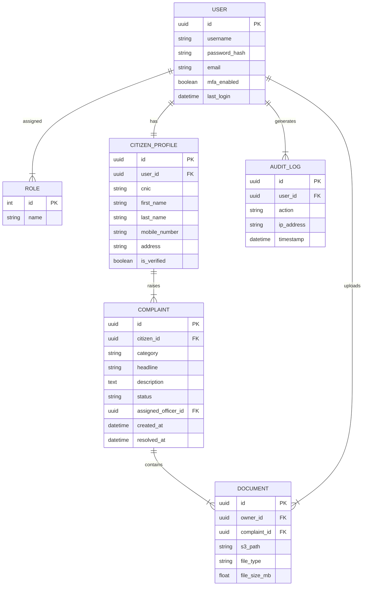

# Database Entity Relationship Diagram (ERD)

The conceptual entity map showcases how bounded contexts interact within the shared PostgreSQL cluster (or database-per-service paradigm).

```mermaid
erDiagram
    USER {
        uuid id PK
        string username
        string password_hash
        string email
        boolean mfa_enabled
        datetime last_login
    }

    ROLE {
        int id PK
        string name
    }

    CITIZEN_PROFILE {
        uuid id PK
        uuid user_id FK
        string cnic
        string first_name
        string last_name
        string mobile_number
        string address
        boolean is_verified
    }

    COMPLAINT {
        uuid id PK
        uuid citizen_id FK
        string category
        string headline
        text description
        string status
        uuid assigned_officer_id FK
        datetime created_at
        datetime resolved_at
    }

    DOCUMENT {
        uuid id PK
        uuid owner_id FK
        uuid complaint_id FK
        string s3_path
        string file_type
        float file_size_mb
    }

    AUDIT_LOG {
        uuid id PK
        uuid user_id FK
        string action
        string ip_address
        datetime timestamp
    }

    USER ||--|{ ROLE : "assigned"
    USER ||--|| CITIZEN_PROFILE : "has"
    CITIZEN_PROFILE ||--|{ COMPLAINT : "raises"
    COMPLAINT ||--|{ DOCUMENT : "contains"
    USER ||--|{ DOCUMENT : "uploads"
    USER ||--|{ AUDIT_LOG : "generates"
```
